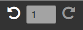

   

# Undo Plugin to init the Editor-Undo and render control buttons in SoSIE editor

## Feature(s)

### init helper

Provides Undo.init() to initialise Undo just after editor isready.

### Sample 



The sample will add the Undo button, the position in History and Redo button on SoSIe Menubar so you will be able to undo and redo changes.

## Integration

Update your html page following these steps:

1. This plugin is dependant from [editorjs-undo](https://github.com/kommitters/editorjs-undo) so you will have to load it loadEditor section

```js
        /**
        * Editor core
        */
        mode='prod'
        source='local';//Works only with local stored dists as we decided not to publish on npm
        target=source+':'+editorDir;
        
        await loadEditor([
            /* SOSIE Editor */
            {'#sosie-js/editor.js@0.7.0':['[.](https://github.com/sosie-js/editor.js)','dist/sosie.js']},
            {'sos-productions/editor.js@next':['[src/editor.js](https://github.com/sos-productions/editor.js)','../../dist/editor.js']},
            /* We need this for the icon butons */
            {'font-awesome@latest':['[src/font-awesome](https://github.com/FortAwesome/Font-Awesome/tree/fa-4)','../../dist/css/font-awesome.min.css']},
            /* Here comes the undo core (big thanks to komiitters!)*/
            {'#editorjs-undo@latest': ['[src/editorjs-undo](https://github.com/kommitters/editorjs-undo)','../../dist/editorjs-undo.js']}
        ],nocache,mode,target);
```

this will generate an equivalent of

```html
<script src="dist/sosie.js"></script>
<script src="dist/editor.js"></script>
<script src="dist/css/font-awesome.min.css"></script>
<script src="dist/editorjs-undo.js"></script>
```

2. Add a line in your html page in the section loadPlugins and the script-loader will do the remaining part

```js
    /**
        * Plugins
        */
         await loadPlugins([
            {'sosie-js/script-loader@3.0.0': '[example/plugins/script-loader](https://github.com/sosie-js/script-loader)'}, //virtual , already loaded we keep a version trace here
            {'sosie-js/undo-plugin@1.0.0': ['[example/plugins/undo-plugin](https://github.com/sosie-js/undo-plugin)',['dist/bundle.js','dist/sample.js']]},
        ],nocache,mode,target);
```

this will generate an equivalent of

```html
<script src="example/plugins/undo-plugin/dist/bundle.js"></script>
<script src="example/plugins/undo-plugin/dist/sample.js"></script>
```

## Building the plugin

To produce the dist/bundle.js for production use the command: 

```shell
yarn build:minify
```
## Known Bugs

- For now I failed to make it work with webpack babel so yarn build will break the build
- Cache issues on updates

## Missing something?

[A demo please SoSie](http://sosie.sos-productions.com/)
